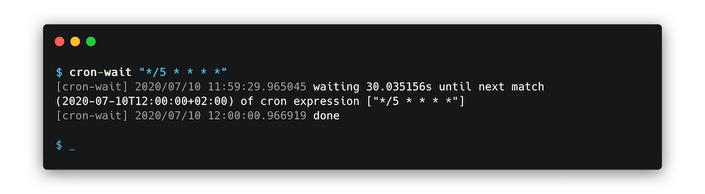

# cron-wait

A tiny tool that waits until a given cron expression would trigger, and then just exits. If multiple expressions are given, it waits until the _first_ (earliest) match.



## Examples

```sh
$ cron-wait "*/5 * * * *"
[cron-wait] 2020/07/10 11:59:29.965045 waiting 30.035156s until next match (2020-07-10T12:00:00+02:00) of cron expression ["*/5 * * * *"]
[cron-wait] 2020/07/10 12:00:00.966919 done
```

```sh
$ cron-wait -print-next-match-and-exit "*/3 * * * *"
2020-07-10T12:48:00+02:00
```

```sh
$ cron-wait -print-delta-and-exit "@hourly"
3308.674034
```

## Contents

- [Get it](#get-it)
- [Usage](#usage)

## Get it

Using go get:

```bash
go get -u github.com/keilerkonzept/cron-wait
```

Or [download the binary for your platform](https://github.com/keilerkonzept/cron-wait/releases/latest) from the releases page.

## Usage

```text
cron-wait [OPTIONS] [CRON_EXPRESSION [CRON_EXPRESSIONS...]]

Usage of cron-wait:
  -dots
    	Print dots to stdout while waiting
  -format string
    	Timestamp format (default "2006-01-02T15:04:05Z07:00")
  -print-delta-and-exit
    	Only print the duration (in seconds) until the next expression match and exit (without waiting)
  -print-next-match-and-exit
    	Only print the timestamp of the next expression match and exit (without waiting)
  -q	(alias for -quiet)
  -quiet
    	Suppress all output
```
