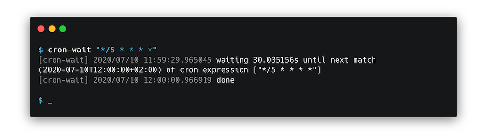

# ${APP}

A tiny tool that waits until a given cron expression would trigger, and then just exits. If multiple expressions are given, it waits until the _first_ (earliest) match.



## Examples

```sh
$ ${APP} "*/5 * * * *"
[${APP}] 2020/07/10 11:59:29.965045 waiting 30.035156s until next match (2020-07-10T12:00:00+02:00) of cron expression ["*/5 * * * *"]
[${APP}] 2020/07/10 12:00:00.966919 done
```

```sh
$ ${APP} -print-next-match-and-exit "*/3 * * * *"
2020-07-10T12:48:00+02:00
```

## Contents

- [Get it](#get-it)
- [Usage](#usage)

## Get it

Using go get:

```bash
go get -u github.com/keilerkonzept/${APP}
```

Or [download the binary for your platform](https://github.com/keilerkonzept/${APP}/releases/latest) from the releases page.

## Usage

```text
${APP} [OPTIONS] [CRON_EXPRESSION [CRON_EXPRESSIONS...]]

${USAGE}
```
